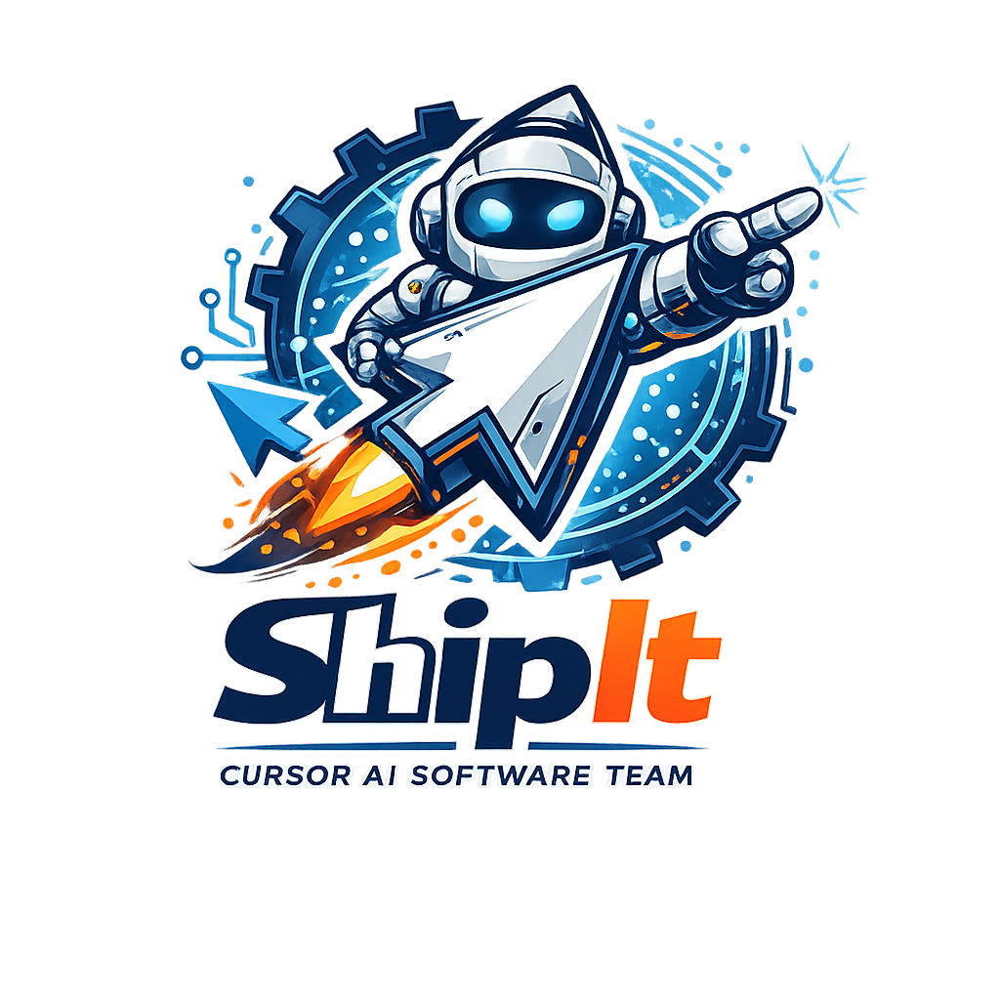

<p align="center">
  
</p>

# ShipIt 🚀

[](https://github.com/NJLaPrell/ShipIt/releases/tag/v1.0.0)
[](https://www.npmjs.com/package/@nlaprell/shipit)
[](./tests/ISSUES.md)
[](LICENSE)

> **Stop optimizing for humans. Start optimizing for AI.**

An SDLC built for AI-assisted development: state in files, tests as truth, gates instead of meetings. Replaces handoffs and docs with executable truth and state-anchored workflows. **Production ready** — CLI-first; see [tests/ISSUES.md](./tests/ISSUES.md) for validation.

**Repository:** [github.com/NJLaPrell/ShipIt](https://github.com/NJLaPrell/ShipIt)

## Table of Contents

- [1. Quick Start](#1-quick-start)
- [2. Prerequisites](#2-prerequisites)
- [3. What You Get](#3-what-you-get)
- [4. Core Workflow](#4-core-workflow)
- [5. The Problem & The Solution](#5-the-problem--the-solution)
- [6. Installation](#6-installation)
- [7. Key Concepts](#7-key-concepts)
- [8. Commands Reference](#8-commands-reference)
- [9. Documentation & Help](#9-documentation--help)
- [10. FAQ](#10-faq)
- [11. License](#11-license)

---

## 1. Quick Start

Get from zero to a running project in under two minutes. Steps 3–4 run in **Cursor** or **VS Code** as slash commands.

### 1.1 Install

```bash
npm install -g @nlaprell/shipit
# Or: npx @nlaprell/shipit init
```

### 1.2 Create a new project (or attach to existing)

```bash
# New project
create-shipit-app my-awesome-app

# Existing project
cd my-existing-app && shipit init
```

You’ll be prompted for tech stack (TypeScript/Node, Python, Other), project description, and high-risk domains.

### 1.3 Open in editor and run first commands

1. Open the project in **Cursor** or **VS Code**.
2. In the editor, run:
   - `/scope-project "Build a todo app with auth"` — AI-assisted feature breakdown, generates intents and runs release plan + roadmap.
   - `/ship F-001` — Runs the full 5-phase workflow (analysis → plan → tests → code → verify → release).

That’s it. The framework drives the rest with progress indicators and gates.

---

## 2. Prerequisites

- **Node.js 20+**
- **Cursor** or **VS Code** (with ShipIt extension for VS Code). See [Using ShipIt in VS Code](docs/vscode-usage.md).
- **Git**

---

## 3. What You Get

After `create-shipit-app` or `shipit init`, your project has:

- **`project.json`** — Project metadata and ShipIt version.
- **`work/intent/`** — Features, bugs, tech-debt as markdown (F-001.md, etc.).
- **`work/workflow-state/`** — Active phase and per-intent state (see [parallel workflow](docs/parallel-workflow.md)).
- **`work/roadmap/`** — now / next / later triage.
- **`work/release/`** — Release plan (what ships when).
- **`scripts/`** — Framework scripts (verify, fix, status, workflow-orchestrator, etc.).
- **`.cursor/`** — Slash commands and rules (or equivalent for VS Code).
- **`_system/`** — Architecture (CANON, invariants), artifacts, behaviors, security, drift. **Do not edit.** Upgraded via `shipit upgrade` only.
- **`.override/`** — Your customizations (rules, commands, scripts, config); never touched by upgrade.

**Do not edit** `_system/` — framework internals. Use `.override/` for customizations.

Optional: **`dashboard-app/`** — Web dashboard; run with `pnpm dashboard`.

Full tree and planning outputs: [docs/DIRECTORY_STRUCTURE.md](./docs/DIRECTORY_STRUCTURE.md).

---

## 4. Core Workflow

One path: **Install CLI → create or init project → open in editor → scope → ship.**

| Phase           | Commands                                                                                      |
| --------------- | --------------------------------------------------------------------------------------------- |
| **Setup**       | CLI: `create-shipit-app` or `shipit init`. Editor: `/scope-project`, `/status`, `/dashboard`. |
| **Planning**    | `/new_intent`, `/generate-release-plan`, `/generate-roadmap`, `/fix`.                         |
| **Execution**   | `/ship <id>`, `/verify <id>`, `/status`.                                                      |
| **Maintenance** | `shipit upgrade`, `/rollback <id>`, `/kill <id>`, `/drift_check`, `/deploy`.                  |

Slash commands run in Cursor or VS Code. Full phase details: [AGENTS.md](./AGENTS.md#workflow).

<details>
<summary><strong>Detailed workflow diagram</strong></summary>

```
┌─────────────────────────────────────────────────────────────────────────┐
│                         ShipIt Workflow                                  │
└─────────────────────────────────────────────────────────────────────────┘

SETUP PHASE
    ├─ create-shipit-app <name>  or  shipit init   (CLI)
    ├─ /scope-project "Description"  →  intents, release plan, roadmap
    └─ /status, /dashboard

PLANNING PHASE
    ├─ /new_intent  →  /generate-release-plan  →  /generate-roadmap
    └─ /fix  (auto-fix intent issues)

EXECUTION PHASE
    ├─ /ship <id>  →  [1] Analysis  →  [2] Plan  →  [3] Tests  →  [4] Code  →  [5] Verify  →  Release
    ├─ /verify <id>, /status
    └─ /rollback <id>, /kill <id>

MAINTENANCE
    ├─ shipit upgrade  (backup in ._shipit_backup/)
    ├─ /drift_check, /deploy
    └─ /test_shipit (framework E2E)
```

</details>

---

## 5. The Problem & The Solution

**The problem:** Traditional SDLC assumes humans are the bottleneck. AI agents need state files, executable tests, explicit gates, and do-not-repeat ledgers — not meetings and handoffs. Most failures are unstated assumptions and ambiguous truth, not coding errors.

**The solution:** ShipIt optimizes for **what counts as truth**: tests and invariants over docs, state in files over meetings, explicit gates over tribal knowledge. Add adversarial verification, intent ledger in `work/intent/`, drift detection, and context-aware suggestions. How the 7 agents (Steward, PM, Architect, Implementer, QA, Security, Docs) work together: [AGENTS.md](./AGENTS.md).

---

## 6. Installation

### 6.1 For app developers

See [Quick Start](#1-quick-start) for the full flow. Quick reference:

| Action             | Command                                           |
| ------------------ | ------------------------------------------------- |
| Install CLI        | `npm install -g @nlaprell/shipit`                 |
| New project        | `create-shipit-app my-app`                        |
| Attach to existing | `cd my-app && shipit init`                        |
| Upgrade framework  | `shipit upgrade` (backs up to `._shipit_backup/`) |
| Check installation | `shipit check`                                    |

No global install: `npx @nlaprell/shipit init` from your project root. Full options: [docs/CLI_REFERENCE.md](./docs/CLI_REFERENCE.md).

### 6.2 From source (contributors)

**pnpm** is used when developing the framework itself:

```bash
git clone https://github.com/NJLaPrell/ShipIt.git
cd ShipIt
pnpm install
pnpm test && pnpm test:cli && pnpm test:shipit -- --clean
# Optional: pnpm validate-cursor  or  pnpm validate-vscode
```

See [docs/CONTRIBUTING.md](./docs/CONTRIBUTING.md).

### 6.3 User customizations (`.override/`)

Put customizations in `.override/rules/`, `.override/commands/`, `.override/scripts/`, `.override/config/`. They are **never** touched by `shipit upgrade`. [docs/USER_OVERRIDES_DESIGN.md](./docs/USER_OVERRIDES_DESIGN.md).

---

## 7. Key Concepts

- **Intent ledger** — All work lives in `work/intent/` as markdown with executable acceptance criteria, confidence scores, invariants, kill criteria, and rollback plan. Use `/fix` to auto-fix common issues. Templates: [AGENTS.md](./AGENTS.md) and `work/intent/templates/`.
- **Tests first** — The workflow enforces Spec → Tests → Code. QA writes tests (they fail); Implementer writes code (tests pass). No production code before tests.
- **Truth hierarchy** — When facts conflict: runtime behavior > tests > invariants > specs > architecture > comments > opinion. [AGENTS.md](./AGENTS.md).
- **High-risk gates** — Auth, payments, permissions, infrastructure, PII require human approval before implementation.

**More:** GitHub integration, usage/cost, security allowlist, confidence calibration → [AGENTS.md](./AGENTS.md).

---

## 8. Commands Reference

**CLI:** `shipit init | upgrade | check | create | list-backups | restore` — see [docs/CLI_REFERENCE.md](./docs/CLI_REFERENCE.md).

**Editor (slash commands):**

| Category        | Commands                                                                                                                                        |
| --------------- | ----------------------------------------------------------------------------------------------------------------------------------------------- |
| **Setup**       | `create-shipit-app` / `shipit init`, `/scope-project`, `/status`, `/dashboard`                                                                  |
| **Planning**    | `/new_intent`, `/generate-release-plan`, `/generate-roadmap`, `/fix`, `/pr`, `/create-pr`, `/create-intent-from-issue`, `/risk`, `/revert-plan` |
| **Execution**   | `/ship <id>`, `/verify <id>`, `/rollback <id>`, `/kill <id>`                                                                                    |
| **Maintenance** | `/drift_check`, `/deploy`, `/test_shipit`                                                                                                       |
| **Utility**     | `/help`, `/suggest`, `/dashboard`, `/usage-record`, `/usage-report`, `/calibration-report`                                                      |

All slash commands are in [.cursor/commands/](./.cursor/commands/). Scripts: `pnpm run <script>` (e.g. `pnpm fix`, `pnpm verify`). Headless/VS Code: [docs/headless-mode.md](./docs/headless-mode.md), [docs/vscode-usage.md](./docs/vscode-usage.md).

---

## 9. Documentation & Help

- [docs/CLI_REFERENCE.md](./docs/CLI_REFERENCE.md) — All CLI commands and options
- [docs/LIMITATIONS.md](./docs/LIMITATIONS.md) — What ShipIt doesn’t do, when not to use
- [docs/TROUBLESHOOTING.md](./docs/TROUBLESHOOTING.md) — Exit codes, common issues, rollback
- [docs/EXAMPLES.md](./docs/EXAMPLES.md) — New project, existing project, upgrade, CI
- [docs/PILOT_GUIDE.md](./docs/PILOT_GUIDE.md) — Step-by-step first feature
- [docs/DIRECTORY_STRUCTURE.md](./docs/DIRECTORY_STRUCTURE.md) — Project layout
- [docs/STABILITY.md](./docs/STABILITY.md) — Stable vs experimental APIs
- [AGENTS.md](./AGENTS.md) — Roles, workflow, conventions
- [CHANGELOG.md](./CHANGELOG.md) — Version history

---

## 10. FAQ

**Q: How do I install ShipIt?**  
A: `npm install -g @nlaprell/shipit`. Then `create-shipit-app <name>` or `shipit init`. [CLI_REFERENCE](./docs/CLI_REFERENCE.md).

**Q: Can I use ShipIt with an existing project?**  
A: Yes. Run `shipit init` in the project root. It merges framework files and package.json. [EXAMPLES](./docs/EXAMPLES.md).

**Q: How do I upgrade?**  
A: `shipit upgrade`. Backups go to `._shipit_backup/`. Use `--dry-run` first. [TROUBLESHOOTING](./docs/TROUBLESHOOTING.md#after-a-failed-or-unwanted-shipit-upgrade).

**Q: Will upgrade overwrite my changes?**  
A: Framework-owned files are updated (with backup). App code and non-framework paths are not. Use `.override/` for customizations so they’re never touched.

**Q: How do I customize Cursor/VS Code rules?**  
A: Add files under `.override/rules/`. [USER_OVERRIDES_DESIGN](./docs/USER_OVERRIDES_DESIGN.md).

**Q: Do I need to understand all 7 agents?**  
A: No. Use the commands; agents run during `/ship`. [AGENTS.md](./AGENTS.md) for depth.

**Q: What about deployment?**  
A: `/deploy` runs readiness checks; actual deployment is your pipeline. See [LIMITATIONS](./docs/LIMITATIONS.md).

**Q: Where do I get help?**  
A: [TROUBLESHOOTING](./docs/TROUBLESHOOTING.md), [GitHub Issues](https://github.com/NJLaPrell/ShipIt/issues).

---

## 11. License

MIT. See [CHANGELOG.md](./CHANGELOG.md) for version history.

---

**Next:** Once you’ve created a project, open it in Cursor or VS Code, run `/scope-project "your goal"`, then `/ship F-001`. Full walkthrough: [docs/PILOT_GUIDE.md](./docs/PILOT_GUIDE.md).
